<!--
File: README.md
Document Title: Sys.Witch V2 — Static Portfolio Theme
Author: Alysha Pursley
Date: June 2026
-->

<div align="center">

# Sys.Witch V2 — Static Portfolio Theme

**An expanded system-witch portfolio with a richer magical interface, technical structure, and upgraded cyber-occult atmosphere.**

[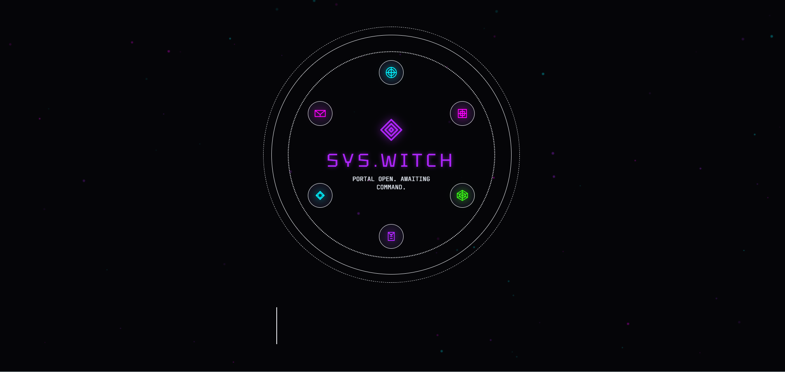](./images/screenshots/sys.witch-v2-screenshot-01.png)

[Open the live demo](https://apursley2012.github.io/sys.witch-v2/) · [Browse the full theme collection](https://github.com/apursley2012/github-pages-themes) · [Report an issue or request an addition](https://github.com/apursley2012/sys.witch-v2/issues/new/choose)

</div>

---

## Table of Contents

- [Theme Overview](#theme-overview)
  - [Purpose](#purpose)
  - [Intended Users](#intended-users)
  - [Design Style and Inspiration](#design-style-and-inspiration)
  - [Main Color Palette](#main-color-palette)
  - [Preview Screenshots](#preview-screenshots)
- [Pages Included](#pages-included)
- [Component Architecture](#component-architecture)
  - [Shared Theme Components](#shared-theme-components)
  - [Shared Site Assets](#shared-site-assets)
  - [Theme-Specific Interactive Behavior](#theme-specific-interactive-behavior)
- [File and Folder Structure](#file-and-folder-structure)
- [Static Project Notes](#static-project-notes)
- [Customization Guide](#customization-guide)
  - [Personal Information and Branding](#personal-information-and-branding)
  - [Biography and Life Story](#biography-and-life-story)
  - [Projects, Skills, Services, and Experience](#projects-skills-services-and-experience)
  - [Contact Information and Social Links](#contact-information-and-social-links)
  - [Images and Screenshots](#images-and-screenshots)
  - [Colors, Fonts, and Styling](#colors-fonts-and-styling)
  - [Navigation](#navigation)
  - [Theme-Specific Editing Checklist](#theme-specific-editing-checklist)
- [GitHub Pages Deployment](#github-pages-deployment)
  - [Required Repository Structure](#required-repository-structure)
  - [Upload the Theme Files](#upload-the-theme-files)
  - [Enable GitHub Pages](#enable-github-pages)
  - [Confirm the Published URL](#confirm-the-published-url)
  - [Update the Published Site](#update-the-published-site)
  - [Important GitHub Pages Files](#important-github-pages-files)
  - [Common GitHub Pages Problems](#common-github-pages-problems)
- [Reporting Theme Issues or Requesting Additions](#reporting-theme-issues-or-requesting-additions)
- [Accessibility and Browser Compatibility](#accessibility-and-browser-compatibility)
  - [Accessibility Considerations](#accessibility-considerations)
  - [Browser Compatibility](#browser-compatibility)
- [Repository Relationship](#repository-relationship)
- [Possible Future Enhancements](#possible-future-enhancements)
- [Copyright](#copyright)

---

## Theme Overview

### Purpose

**Sys.Witch V2** is a distinctive static portfolio theme with an atmospheric presentation, expressive visual details, and a practical structure for showcasing professional work.

This theme can be opened locally, hosted with GitHub Pages, or adapted into a standalone personal website. The included files are ready to publish directly from a GitHub repository.

### Intended Users

This theme is best suited to portfolio owners who want a site with a defined personality rather than a generic landing-page layout. It can be adapted for software development, design, technical writing, digital art, creative work, freelance services, coursework, personal projects, or a combination of professional and personal storytelling.

### Design Style and Inspiration

Category: **Mystical and Haunted**

The visual direction draws from mystical interfaces, atmospheric storytelling, dramatic color contrast, and playful supernatural details. The theme should remain expressive and memorable while keeping portfolio content easy to browse.

The visual language should remain recognizable when the content is customized. New content should fit into the existing structure while preserving the layout, spacing, contrast, and palette unless the person using the theme intentionally wants to create a new variation.

### Main Color Palette

The theme styling uses the following palette:

| Color | Primary Use |
| --- | --- |
| `#FFF` | Used throughout the theme styling |
| `#9CA3AF` | Used throughout the theme styling |
| `#E5E7EB` | Used throughout the theme styling |
| `#050508` | Used throughout the theme styling |
| `#0A0A12` | Used throughout the theme styling |
| `#12101C` | Used throughout the theme styling |
| `#B026FF` | Used throughout the theme styling |
| `#FF00FF` | Used throughout the theme styling |
| `#00F3FF` | Used throughout the theme styling |
| `#39FF14` | Used throughout the theme styling |

### Preview Screenshots

Click any preview link or image to open the full-size file.

### Preview Screenshots

Click any preview link or image to open the full-size file.

<p align="center">
  
  &nbsp;&nbsp;
  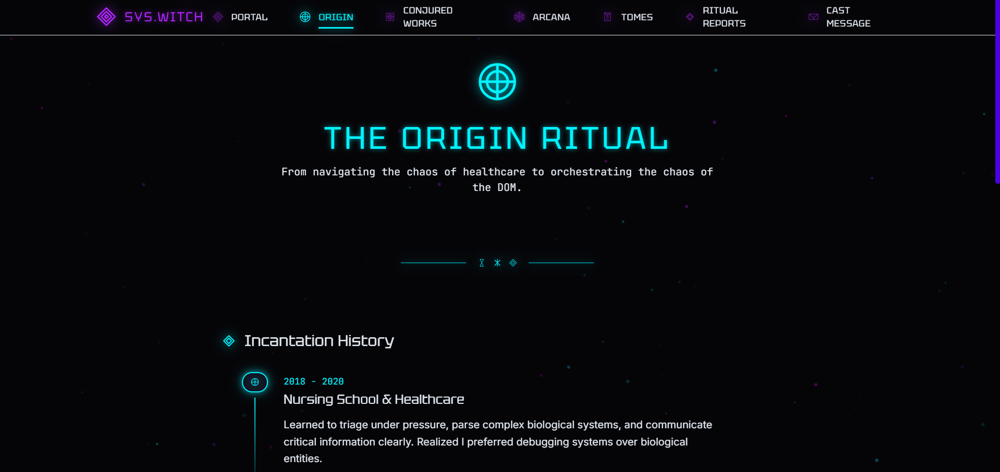
</p>
<p align="center">
  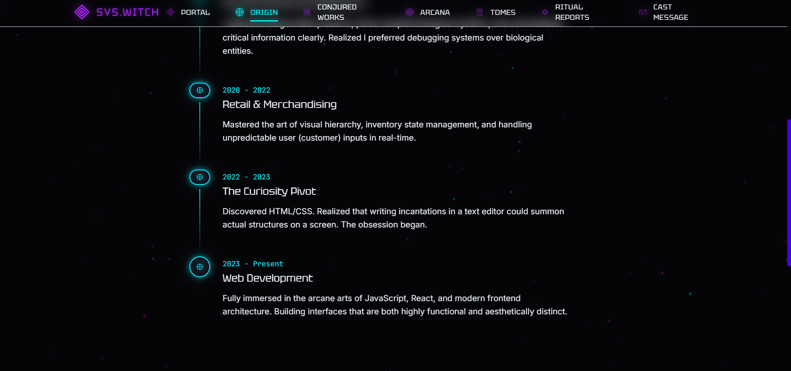
  &nbsp;&nbsp;
  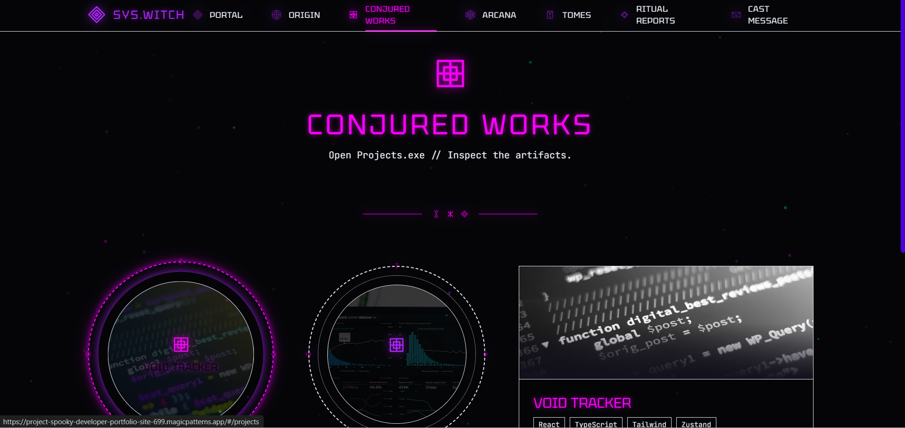
</p>
<p align="center">
  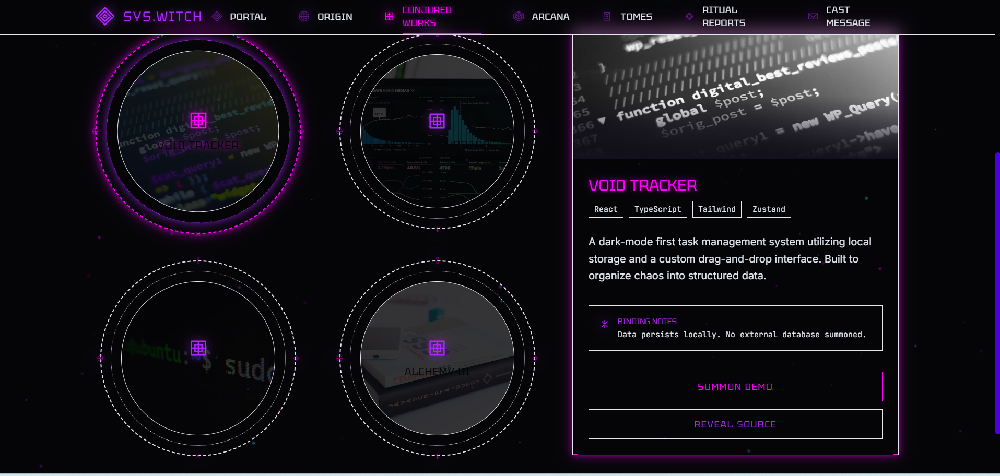
  &nbsp;&nbsp;
  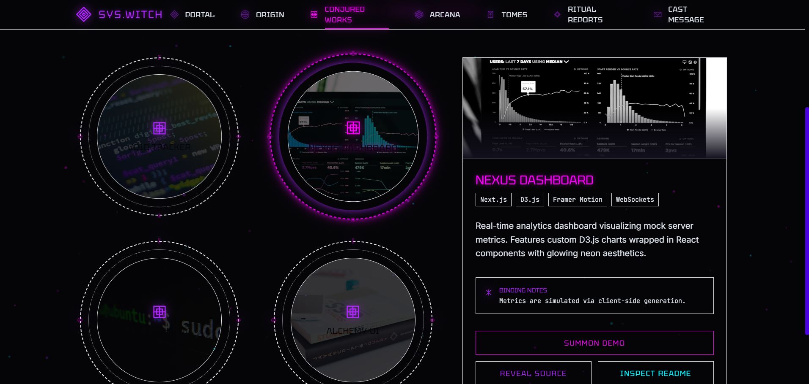
</p>
<p align="center">
  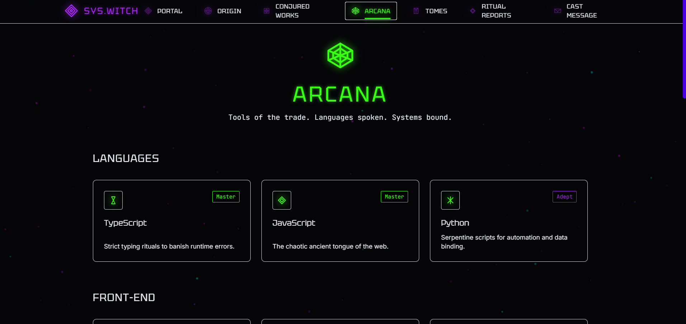
  &nbsp;&nbsp;
  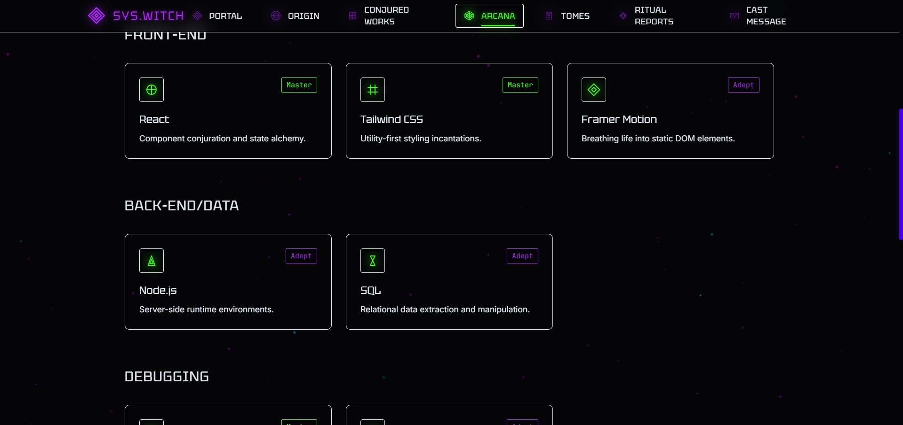
</p>
<p align="center">
  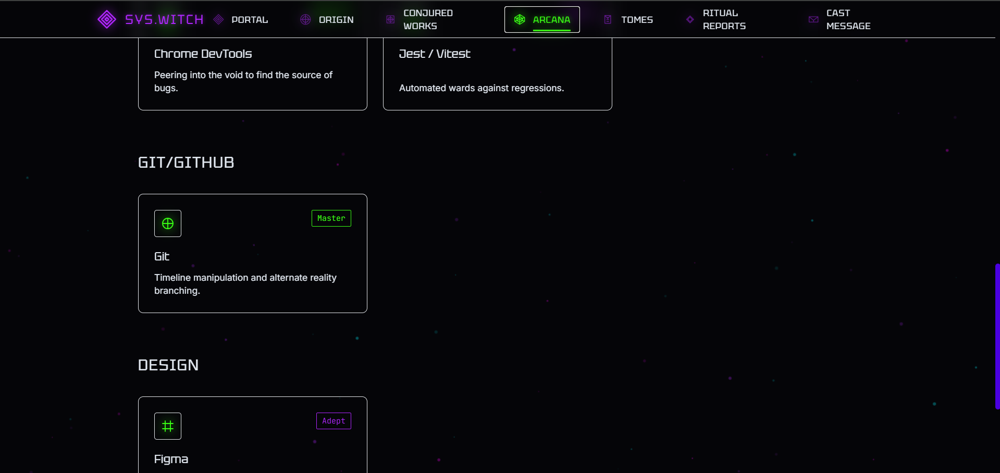
  &nbsp;&nbsp;
  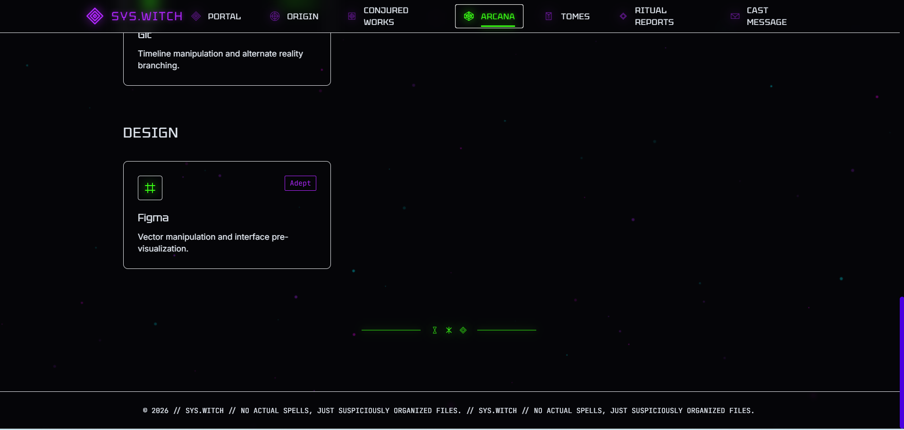
</p>
<p align="center">
  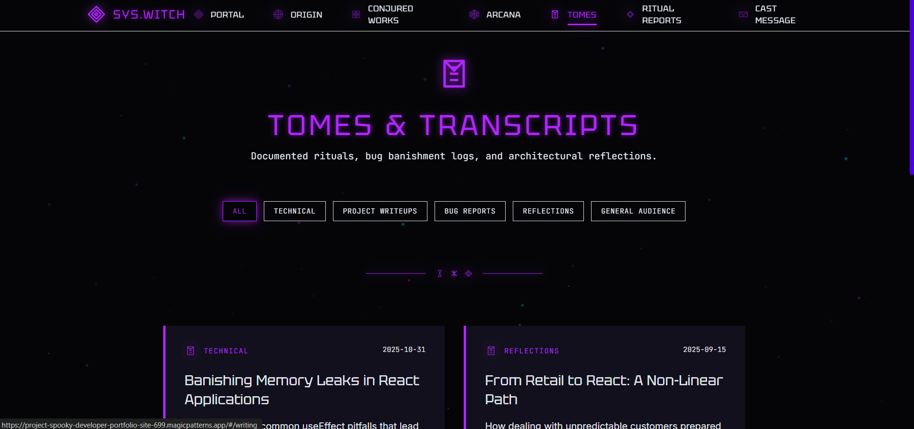
  &nbsp;&nbsp;
  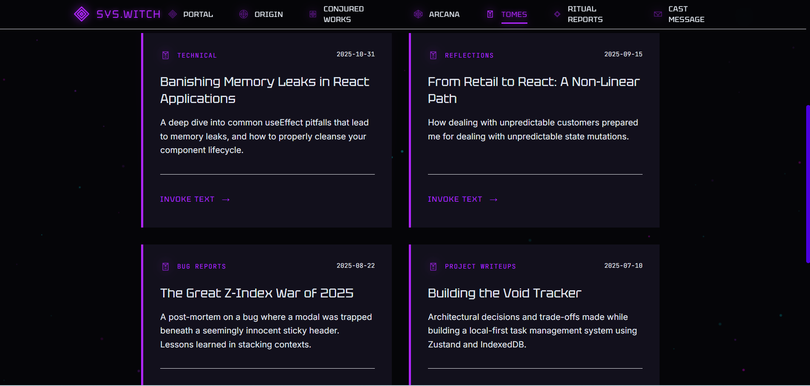
</p>
<p align="center">
  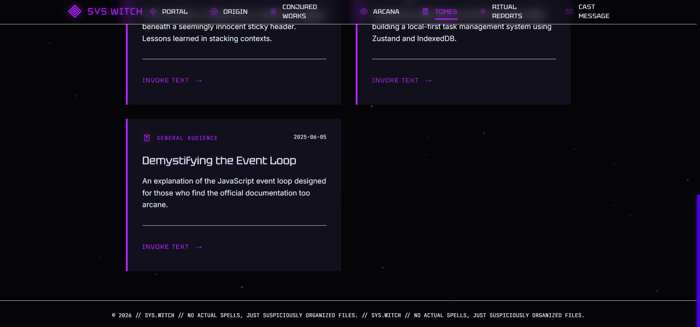
  &nbsp;&nbsp;
  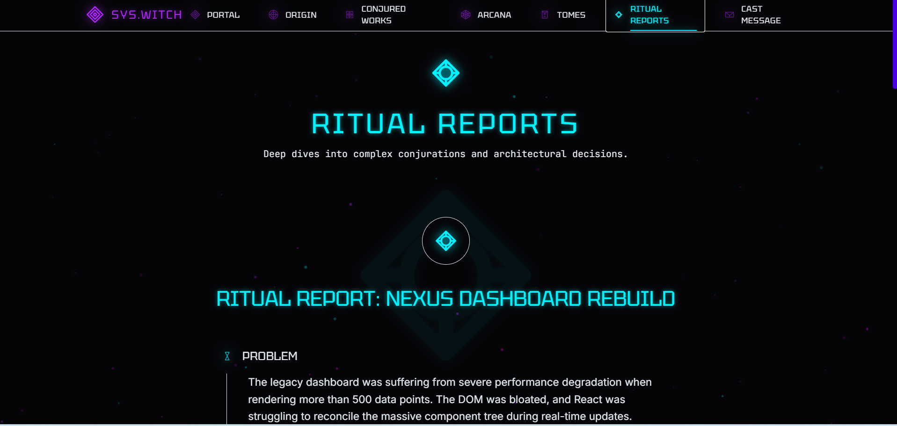
</p>
<p align="center">
  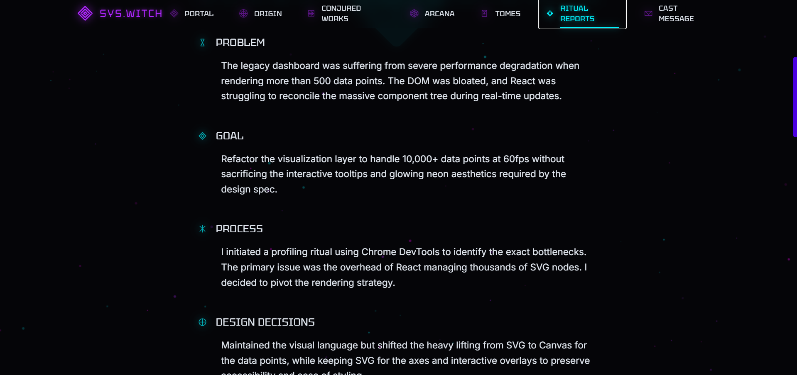
  &nbsp;&nbsp;
  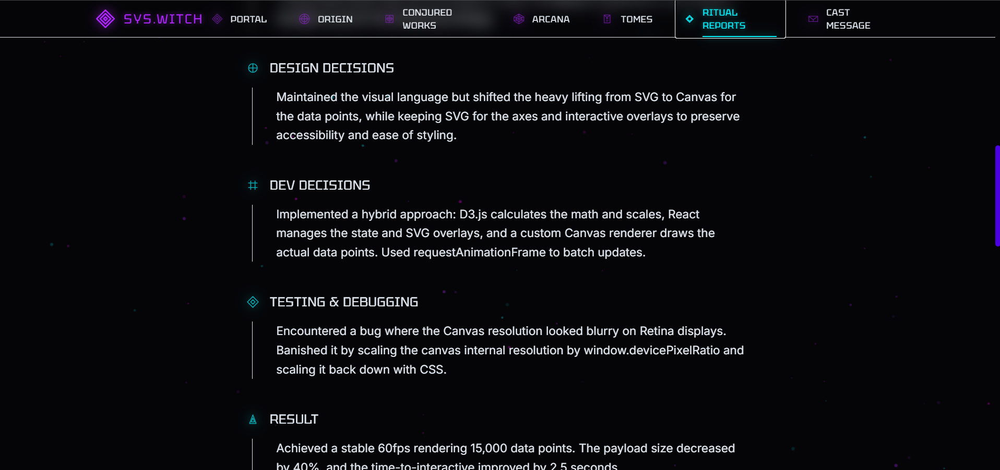
</p>
<p align="center">
  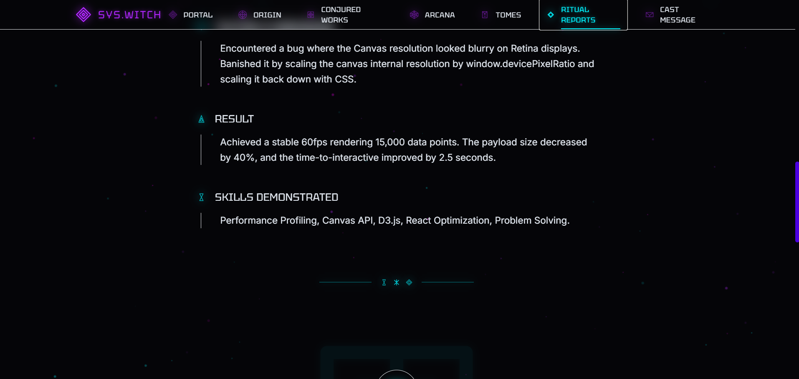
  &nbsp;&nbsp;
  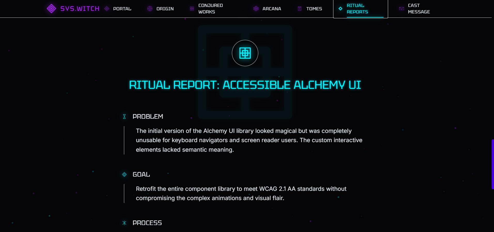
</p>
<p align="center">
  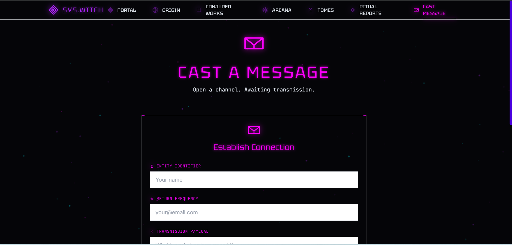
  &nbsp;&nbsp;
  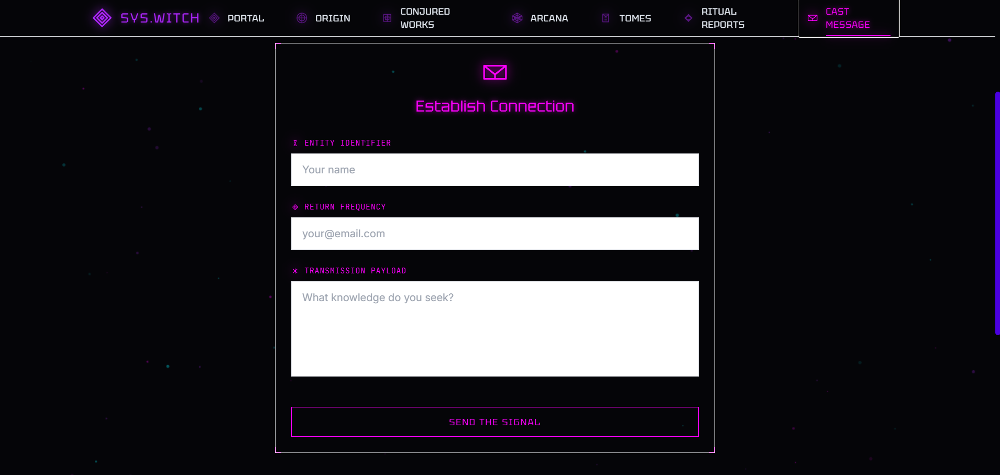
</p>
<p align="center">
  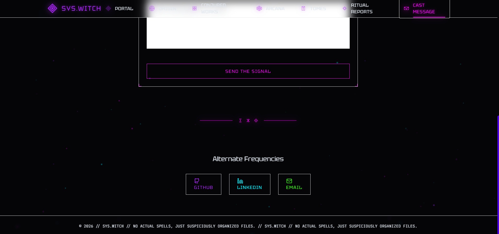
</p>

#### Screenshot Gallery

[](https://github.com/apursley2012/sys.witch-v2/tree/main/images/screenshots)


---

## Pages Included

The portfolio pages are kept as separate HTML entry files.

| Page | Purpose |
| --- | --- |
| `index.html` | Main homepage and GitHub Pages entry file |
| `about.html` | Biography and background page |
| `articles.html` | Article index |
| `casestudies.html` | Detailed project and technical breakdowns |
| `contact.html` | Contact details and communication links |
| `placeholders.html` | Placeholder content used where additional content can be added later |
| `projects.html` | Featured project portfolio |
| `skills.html` | Skills, technologies, and capabilities |
| `testimonials.html` | Testimonials and feedback |
| `work.html` | Professional experience and work history |
| `writing.html` | Writing archive and long-form content |

`index.html` is the homepage and GitHub Pages entry file. A separate `home.html` file is not required.

---

## Component Architecture

### Shared Theme Components

| Component | Purpose |
| --- | --- |
| `components/about/TimelineEntry.js` | Provides reusable theme interface behavior |
| `components/about/TraitSigilGrid.js` | Provides reusable theme interface behavior |
| `components/case/RitualReport.js` | Provides reusable theme interface behavior |
| `components/contact/SummoningForm.js` | Provides reusable theme interface behavior |
| `components/layout/Layout.js` | Provides shared layout and page framing |
| `components/layout/ParticleField.js` | Provides reusable theme interface behavior |
| `components/layout/PortalNav.js` | Provides shared navigation behavior |
| `components/layout/RuneDivider.js` | Provides reusable theme interface behavior |
| `components/projects/ProjectPanel.js` | Provides reusable theme interface behavior |
| `components/projects/SummoningCircle.js` | Provides reusable theme interface behavior |
| `components/sigils/PortalRing.js` | Provides reusable theme interface behavior |
| `components/sigils/Sigil.js` | Provides reusable theme interface behavior |
| `components/skills/RuneTile.js` | Provides reusable theme interface behavior |
| `components/ui/GlowFrame.js` | Provides reusable theme interface behavior |
| `components/ui/GlyphButton.js` | Provides reusable theme interface behavior |
| `components/writing/TomeCard.js` | Provides reusable content-card behavior |

### Shared Site Assets

| Asset | Purpose |
| --- | --- |
| `assets/index.js` | Shared site script |
| `assets/index2.js` | Shared site script |
| `assets/jsx-runtime.js` | Shared supporting script |
| `assets/main.css` | Main stylesheet and visual presentation |
| `assets/main.js` | Main site script |
| `assets/proxy.js` | Shared supporting script |

### Theme-Specific Interactive Behavior

- `components/about/TimelineEntry.js` supports the shared interface presentation.
- `components/about/TraitSigilGrid.js` supports the shared interface presentation.
- `components/case/RitualReport.js` supports the shared interface presentation.
- `components/contact/SummoningForm.js` supports the shared interface presentation.
- `components/layout/Layout.js` supports the shared interface presentation.
- `components/layout/ParticleField.js` supports the shared interface presentation.
- `components/layout/PortalNav.js` supports the shared interface presentation.
- `components/layout/RuneDivider.js` supports the shared interface presentation.

Decorative effects remain separate from the written portfolio content whenever possible. This makes it easier to update text, projects, and contact information without unintentionally changing the visual structure.

---

## File and Folder Structure

```text
sys.witch-v2/
├── .github/
│   └── ISSUE_TEMPLATE/
│       ├── bug_report.md
│       ├── custom.md
│       └── feature_request.md
├── assets/
│   ├── index.js
│   ├── index2.js
│   ├── jsx-runtime.js
│   ├── main.css
│   ├── main.js
│   └── proxy.js
├── components/
│   ├── about/
│   │   ├── TimelineEntry.js
│   │   └── TraitSigilGrid.js
│   ├── case/
│   │   └── RitualReport.js
│   ├── contact/
│   │   └── SummoningForm.js
│   ├── layout/
│   │   ├── Layout.js
│   │   ├── ParticleField.js
│   │   ├── PortalNav.js
│   │   └── RuneDivider.js
│   ├── projects/
│   │   ├── ProjectPanel.js
│   │   └── SummoningCircle.js
│   ├── sigils/
│   │   ├── PortalRing.js
│   │   └── Sigil.js
│   ├── skills/
│   │   └── RuneTile.js
│   ├── ui/
│   │   ├── GlowFrame.js
│   │   └── GlyphButton.js
│   └── writing/
│       └── TomeCard.js
├── data/
│   ├── caseStudies.js
│   ├── projects.js
│   ├── sigils.js
│   ├── skills.js
│   └── writing.js
├── images/
│   └── screenshots/
│       ├── sys.witch-v2-screenshot-01.png
│       ├── sys.witch-v2-screenshot-02.png
│       ├── sys.witch-v2-screenshot-03.png
│       ├── sys.witch-v2-screenshot-04.png
│       ├── sys.witch-v2-screenshot-05.png
│       ├── sys.witch-v2-screenshot-06.png
│       ├── sys.witch-v2-screenshot-07.png
│       ├── sys.witch-v2-screenshot-08.png
│       ├── sys.witch-v2-screenshot-09.png
│       ├── sys.witch-v2-screenshot-10.png
│       ├── sys.witch-v2-screenshot-11.png
│       ├── sys.witch-v2-screenshot-12.png
│       ├── sys.witch-v2-screenshot-13.png
│       ├── sys.witch-v2-screenshot-14.png
│       ├── sys.witch-v2-screenshot-15.png
│       ├── sys.witch-v2-screenshot-16.png
│       ├── sys.witch-v2-screenshot-17.png
│       ├── sys.witch-v2-screenshot-18.png
│       ├── sys.witch-v2-screenshot-19.png
│       ├── sys.witch-v2-screenshot-20.png
│       └── sys.witch-v2-screenshot-21.png
├── .nojekyll
├── about.html
├── articles.html
├── casestudies.html
├── contact.html
├── index.html
├── placeholders.html
├── projects.html
├── README.md
├── skills.html
├── testimonials.html
├── work.html
└── writing.html
```

The folders work together as follows:

- `index.html` is the homepage and GitHub Pages entry file.
- The remaining root-level `.html` files keep portfolio sections separately accessible.
- `components/` contains reusable interface behavior when that folder is included.
- `assets/` contains shared styles and scripts.
- `images/screenshots/` stores repository preview images.
- `.github/ISSUE_TEMPLATE/` stores forms for reporting problems and requesting additions when present.
- `.nojekyll` tells GitHub Pages to publish the files directly.

---

## Static Project Notes

This project is designed for direct static hosting.

- The homepage is `index.html`.
- Portfolio sections remain available through `about.html`, `articles.html`, `casestudies.html`, `contact.html`, `placeholders.html`, `projects.html`, `skills.html`, `testimonials.html`, `work.html`, `writing.html`.
- Shared styles and scripts stay organized inside their existing folders.
- Internal file paths are relative so the theme works correctly at its GitHub Pages project URL.
- No additional configuration file is required for the recommended GitHub Pages setup.

---

## Customization Guide

### Personal Information and Branding

Start with `index.html`. Update the displayed portfolio-owner name, professional headline, homepage introduction, and any themed labels that should reflect the new owner's voice.

### Biography and Life Story

Update the biography content presented through the About page when that page is included. This is the best place to explain the portfolio owner's background, goals, interests, career transition, education, creative influences, or personal approach to work.

### Projects, Skills, Services, and Experience

Update the page files that correspond to the site's portfolio sections. Common editing locations include:

- `projects.html` for featured work, screenshots, descriptions, and links
- `skills.html` for languages, tools, technologies, and capabilities
- `work.html` for professional experience
- `casestudies.html` or `case-studies.html` for detailed project breakdowns
- `articles.html`, `article.html`, `blogindex.html`, or `writing.html` for articles and long-form writing
- `testimonials.html` for testimonials and feedback

Only edit files that are included in this repository.

### Contact Information and Social Links

Update the contact details presented through `contact.html` when that page is included. Replace email addresses, GitHub links, LinkedIn links, downloadable résumé links, and any other external profiles before publishing a personalized copy.

### Images and Screenshots

Store added images inside `images/` or a clearly named subfolder. Use readable filenames and update all matching paths.

The documentation previews are stored in:

```text
images/screenshots/
```

Replace preview placeholders or add screenshots after personalizing the theme so visitors can see the finished design before downloading it.

### Colors, Fonts, and Styling

Review the stylesheet files inside `assets/` before changing colors, fonts, spacing, or decorative details. Use targeted edits rather than rewriting the entire stylesheet so layout behavior remains stable.

### Navigation

Test every navigation link after editing the theme. GitHub Pages paths are case-sensitive.

For the homepage, use:

```html
<a href="index.html">Home</a>
```

### Theme-Specific Editing Checklist

1. Replace the homepage introduction and portfolio-owner information.
2. Update biography and background information where included.
3. Replace the default project, work-history, skills, case-study, writing, testimonial, and contact content where included.
4. Replace external profile links and downloadable file links.
5. Add or replace images while keeping filenames and paths consistent.
6. Update repository screenshots after personalizing the theme.
7. Test navigation, interactive behavior, and mobile layout.
8. Confirm that `index.html` remains at the repository root.
9. Keep the empty `.nojekyll` file beside `index.html`.

---

## GitHub Pages Deployment

### Required Repository Structure

Upload the **contents** of the theme folder so `index.html` sits directly at the repository root.

Correct:

```text
sys.witch-v2/
├── .nojekyll
├── index.html
├── assets/
└── README.md
```

Incorrect:

```text
sys.witch-v2/
└── sys.witch-v2/
    ├── index.html
    └── assets/
```

### Upload the Theme Files

To upload through the GitHub website:

1. Create or open the repository.
2. Select **Add file**.
3. Select **Upload files**.
4. Drag the extracted theme files and folders into the upload area.
5. Confirm that `index.html` appears at the top level of the repository.
6. Confirm that `.nojekyll` and all included asset folders were uploaded.
7. Add a commit message.
8. Select **Commit changes**.

### Enable GitHub Pages

1. Open the repository on GitHub.
2. Select **Settings**.
3. Select **Pages** from the sidebar.
4. Under **Build and deployment**, choose **Deploy from a branch**.
5. Select:

   ```text
   Branch: main
   Folder: / (root)
   ```

6. Select **Save**.

### Confirm the Published URL

The live GitHub Pages URL is:

```text
https://apursley2012.github.io/sys.witch-v2/
```

Open the URL and test the homepage, navigation, images, styling, and interactive details.

### Update the Published Site

Committed changes to the selected publishing branch are republished automatically.

To update files through the GitHub website:

1. Open the repository.
2. Open the file to edit.
3. Select the pencil-shaped **Edit this file** button.
4. Make the change.
5. Select **Commit changes**.
6. Refresh the live site after the update is published.

### Important GitHub Pages Files

#### `index.html`

`index.html` is the homepage and GitHub Pages entry file. It must remain at the repository root.

#### `.nojekyll`

`.nojekyll` is an empty file stored beside `index.html`. The filename is the instruction. It should remain completely empty.

Correct:

```text
.nojekyll
```

Incorrect:

```text
nojekyll
.nojekyll.txt
nojekyll.md
```

#### Why `_config.yml` Is Not Required

This theme does not require `_config.yml` or `config.yaml`. Keep `.nojekyll` at the repository root and publish from `main` and `/(root)`.

### Common GitHub Pages Problems

#### The site shows a 404 page

Confirm that:

1. GitHub Pages is enabled under **Settings** → **Pages**.
2. The selected source is `main` and `/(root)`.
3. `index.html` is at the repository root.
4. The files were not uploaded inside an unnecessary second folder layer.
5. The repository name in the live URL is correct.

#### The site is blank or missing styling

Confirm that:

1. Every included asset folder was uploaded.
2. File paths were not changed.
3. Filenames and capitalization match exactly.

#### Images do not load

Confirm that:

1. The complete `images/` folder was uploaded when included.
2. Image filenames and paths match exactly.
3. Filename capitalization has not changed.

#### The homepage does not load automatically

Confirm that the homepage is named exactly:

```text
index.html
```

#### The `.nojekyll` file looks empty

That is correct. It is supposed to be empty.

#### Changes do not appear immediately

Confirm that:

1. The latest changes were committed to the selected branch.
2. The correct file was edited.
3. The browser is not showing a cached copy.
4. The live URL matches the repository name.

---

## Reporting Theme Issues or Requesting Additions

Use the repository's issue forms:

[Report an issue or request an addition](https://github.com/apursley2012/sys.witch-v2/issues/new/choose)

When reporting an issue, include the affected page, the browser or device being used, a description of what happened, and a screenshot when possible.

---

## Accessibility and Browser Compatibility

### Accessibility Considerations

Before publishing a personalized version, test:

- Keyboard navigation
- Link focus states
- Mobile-width behavior
- Image alternative text
- Heading order
- Reduced-motion preferences
- Color contrast
- Readability of decorative text

Decorative effects should not block navigation, trap focus, or flash rapidly.

### Browser Compatibility

The project is intended for current versions of Chrome, Firefox, Safari, and Edge. Test the final personalized version on both desktop and mobile screens because decorative elements can make spacing changes more noticeable.

---

## Repository Relationship

This theme is maintained as a standalone repository and linked from the main GitHub Pages Portfolio Themes collection.

- Live GitHub Pages demo: `https://apursley2012.github.io/sys.witch-v2/`
- Main collection repository: `https://github.com/apursley2012/github-pages-themes`
- Visual theme gallery: `https://apursley2012.github.io/github-pages-themes/`

The main collection repository acts as a directory. It links visitors to this theme's live demo, repository, and issue-request form.

---

## Possible Future Enhancements

- Add or refresh repository screenshots after personalizing the theme.
- Add a visible reduced-motion option when the interface includes animation.
- Add a themed `404.html` page.
- Expand the issue-request form when the theme gains new customization options.
- Add additional accessibility refinements after testing the personalized content.

---

## Copyright

Copyright © 2026 Alysha Pursley. All rights reserved.

This theme and its documentation are maintained by Alysha Pursley. Review the repository license and any project-specific usage terms before redistributing modified versions.
